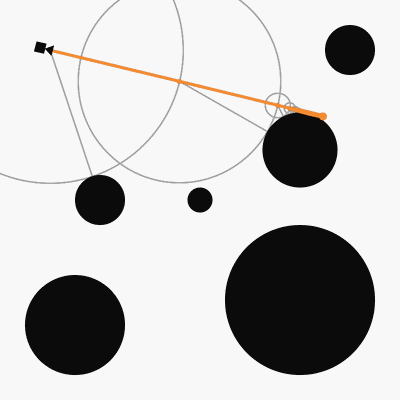

# Everyday One Motion - 20160204 "How Raymarcher Works"

Processing

[Everyday One Motion](http://motions.work/motion/88)  

## Raymarcher

今回は技術紹介的な感じです。  
いつも自分がやっているレイマーチングというレンダリング手法がどのようにして行われているかをアニメーションにしてみました。  
左上のカメラから球体まで、光が探索されていることがわかると思います。  

### 距離関数

レイマーチングでは、「距離関数」と呼ばれる関数が非常に重要となります。  
距離関数とは、「引数として渡した座標」から「描画するシーン内に存在する任意の物体の表面」までの距離を返す関数です。  
今回のgifの場合、球体が6つあるシーンを描画したいため、6つの球体の表面の中から最も近いものまでの距離を返す位置関数を用います。  

### Raymarching

レイマーチングでは、距離関数を再帰的に利用して光を進ませていき、光を物体と衝突させます。  
まず、光はカメラと同じ座標から進み始めます。光の進む方向は一定です。  
ここから、

- 光の現在位置を引数として距離関数を計算
- 帰ってきた距離だけ光を進める

という処理を繰り返していくと（今回は最大32回）、最終的に光を物体に衝突させることができ、シーンをレンダリングすることができます。  

### 「スレスレ」が苦手

このgifでは、灰色の円の数がそのまま距離関数の実行回数となるのですが、光が球体スレスレを通る場合に円の数がとても多くなっていることがわかると思います。  
このように、光を進めても本当は何も無いにもかかわらず、光が物体とスレスレの位置を通るため距離関数の実行回数が多くなってしまったり、本来何もない場所にアーティファクトがレンダリングされてしまう、ということはよくあります。  

実際、今回のアニメーションでも1フレームだけアーティファクトが発生してしまっています…。  
下図では、光が球体スレスレを通っているため、本来光が止まるはずでない場所で光の探索が終了していることがわかると思います。  

### 実態・距離関数

今回は距離関数から帰ってきた距離と全く同じだけ光を進めていますが、フラクタルなどの複雑な距離関数を用いる場合、距離関数から帰ってきた距離に0.8や0.7などを掛け算した分だけ光を進めたり、一度に進む距離を制限したりと工夫が必要となります。  
